# Samrat Mallick – Fullstack Portfolio Platform

> Private, personal portfolio & CMS (not open source)

Modern MERN-based platform powering Samrat Mallick’s public-facing portfolio and an authenticated admin console for managing all content (hero, projects, services, skills, education, about, contact).

---

## Overview
- **Public experience**: High-performing, responsive portfolio with featured projects, services, skills, education timeline, and contact form.
- **Admin console**: Secure dashboard to manage all portfolio content, media uploads to Cloudinary, and OTP-backed account actions.
- **API-first**: Layered Express + MongoDB backend with JWT auth, validation, logging, and cloud storage.

---

## End-to-End API Request Flow
1. **Frontend call** (React + Axios) → `VITE_API_BASE_URL` (`/api/v1/...`).
2. **Routing**: Express v5 mounts versioned routers (`/admin`, `/hero`, `/about`, `/education`, `/projects`, `/services`, `/contact`, `/skills`) @ backend/src/routes/v1Routes/v1.routes.js.
3. **Middleware**:
   - `authenticate` (JWT httpOnly cookie) protects admin-only routes.
   - `validation.middleware` validates payloads (e.g., contact message, CRUD forms).
   - `upload.middleware` handles Multer file buffers for media uploads.
4. **Controllers → Services → Repositories → MongoDB**:
   - Example public fetch: GET `/projects/get-all-projects` → project controller → service → repo → Mongo → JSON response.
   - Example admin update: POST `/hero/add-and-update-hero-content` (auth, upload) → hero controller/service → Cloudinary upload → Mongo update.
5. **Cloudinary**: Media buffers uploaded, returning `public_id` + `secure_url` stored in Mongo.
6. **Email/OTP**: Nodemailer SMTP for contact acknowledgments and admin OTP flows.
7. **Response format**: Standardized success/error envelope with timestamps.

### Public-side calls
- Content fetch: `/hero/get-hero-content`, `/about/get-about`, `/services/get-all-services`, `/skills/get-all-skills`, `/education/get-all-education`, `/projects/get-all-projects`, `/projects/get-featured-projects`, `/contact/get-contact-details`.
- Contact form submit: POST `/contact/send-message` (validation, email notifications).

### Admin-side calls (JWT required)
- Auth: `/admin/initialize` (one-time), `/admin/login`, `/admin/logout`, OTP endpoints for email/password updates.
- Content CRUD: hero, about, services, skills, education, projects (including set featured), contact details, message management (read/delete/count).
- File uploads: Multer + Cloudinary for hero/profile, project images, service/contact images.

### Client handling
- Axios base URL + interceptors (frontend/src/config/api.js) to send credentials, parse responses, and surface errors to UI.
- Redux Toolkit thunks wrap API helpers (e.g., contact.slice for sending messages and fetching contact details).

---

## Authentication Flow
1. **Admin Initialization**: POST `/api/v1/admin/initialize` (one-time).
2. **Login**: POST `/api/v1/admin/login` (returns JWT in httpOnly cookie).
3. **Protected Routes**: `authenticate` middleware guards admin endpoints.
4. **Token Storage**: httpOnly cookie named `token`.
5. **OTP System**: Email-based OTP for password/email changes.

---

## API Routes
**Base URL**: `http://localhost:8000/api/v1`

### Admin Routes (`/admin`)
- POST `/initialize` - Create first admin
- POST `/login` - Admin login
- POST `/logout` - Admin logout (Auth)
- GET `/get-admin-user` - Get current admin (Auth)
- POST `/generate-otp` - Generate OTP (Auth)
- POST `/verify-otp-update-email` - Update email (Auth)
- POST `/verify-otp-update-password` - Update password (Auth)

### Hero Routes (`/hero`)
- POST `/add-and-update-hero-content` (Auth)
- GET `/get-hero-content`
- GET `/get-hero-content/:id`
- PUT `/update-hero-content/:id` (Auth)
- DELETE `/delete-hero-content/:id` (Auth)
- GET `/get-all-hero-content` (Auth)

### Project Routes (`/projects`)
- POST `/add-project` (Auth)
- GET `/get-all-projects`
- GET `/get-project/:projectId`
- PUT `/update-project/:projectId` (Auth)
- DELETE `/delete-project/:projectId` (Auth)
- GET `/get-featured-projects`
- POST `/set-featured-projects` (Auth)
- GET `/get-all-projects-admin` (Auth)
- GET `/get-projects-by-category/:category`
- GET `/get-projects-by-technology/:technology`

### Other Routes
- `/skills` - Skills CRUD
- `/about` - About section CRUD
- `/education` - Education CRUD
- `/services` - Services CRUD
- `/contact` - Contact form submission

---

## Architecture Overview

### Request Flow
```
User → Frontend (React) → API Call (Axios) → Backend (Express) → Database (MongoDB)
                                               ↓
                                       Cloudinary (Images)
                                               ↓
                                       Email Service (Nodemailer)
```

### Backend Layers
```
Routes → Controllers → Services → Repositories → Models → Database
```

### Authentication Flow
```
1. Admin login → JWT generated → Stored in httpOnly cookie
2. Protected route → Middleware checks JWT → Attaches admin to req
3. Controller accesses req.admin for user info
```

---

## Features
### Public
- Responsive landing, hero, featured projects, project listing, services, skills, education, and contact sections.
- Contact form posting to backend API with validation and email delivery.
- SEO-friendly metadata and smooth micro-animations.

### Admin
- Content management for hero, about, services, skills, education, projects, and contact details.
- Media upload pipeline (Multer + Cloudinary) with URL storage.
- Auth with JWT (httpOnly cookie), OTP flows for sensitive changes, and role-locked routes.
- Dashboard analytics cards, list/detail views, and inline editing forms.

### Platform
- Express v5 API with layered architecture (routes → controllers → services → repositories → models).
- MongoDB via Mongoose v9, structured validation, and Winston logging.
- Frontend built with React (Vite), React Router v7, Redux Toolkit, Tailwind CSS v4 utilities, and Axios.

---

## Tech Stack
**Frontend**
- React 19 (Vite), React Router v7, Redux Toolkit, Axios
- Tailwind CSS v4, class-variance-authority, lucide-react icons, Radix UI primitives

**Backend**
- Node.js 18+, Express 5, MongoDB + Mongoose 9
- JWT auth, bcryptjs, cookie-parser, Multer, Cloudinary
- Nodemailer (SMTP), express-validator, Winston logging, CORS

---

## Project Structure
```
Fullstack_Portfolio/
├── backend/
│   ├── src/
│   │   ├── config/        # DB, logger, and app configuration
│   │   ├── controllers/   # HTTP handlers
│   │   ├── middleware/    # auth, validation, upload, error handling
│   │   ├── model/         # Mongoose schemas
│   │   ├── repository/    # Data access layer
│   │   ├── routes/        # API route definitions
│   │   ├── service/       # Business logic
│   │   ├── utilities/     # Cloudinary, email, response helpers
│   │   ├── app.js
│   │   └── server.js
│   └── package.json
├── frontend/
│   ├── public/
│   ├── src/
│   │   ├── assets/portfolio_web-view_screenshorts/  # Product screenshots
│   │   ├── components/   # common, admin, public
│   │   ├── pages/        # routed pages
│   │   ├── context/      # state management
│   │   ├── services/     # API clients
│   │   ├── hooks/        # custom hooks
│   │   ├── utils/        # helpers
│   │   ├── styles/       # global styles
│   │   ├── App.jsx
│   │   └── main.jsx
│   └── package.json
└── README.md
```

---

## Screenshots
### Public experience
| Hero & CTA | Featured projects |
| --- | --- |
| 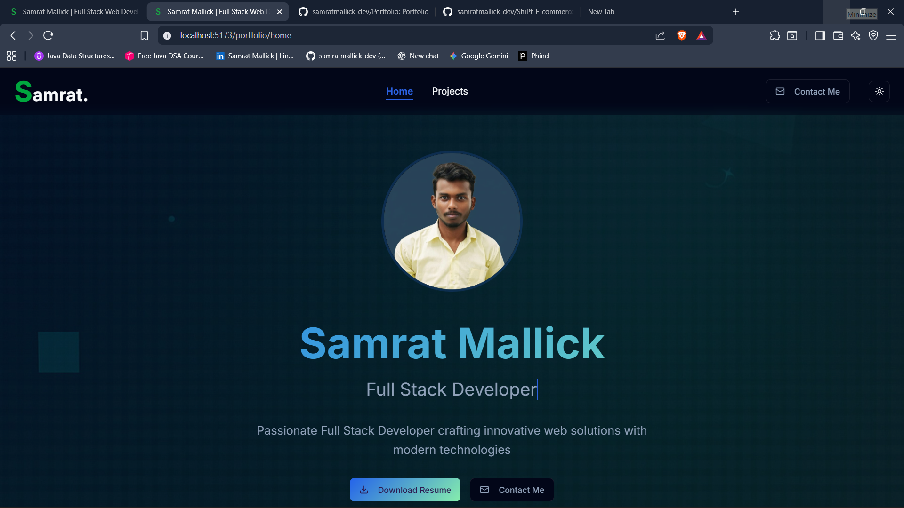 | 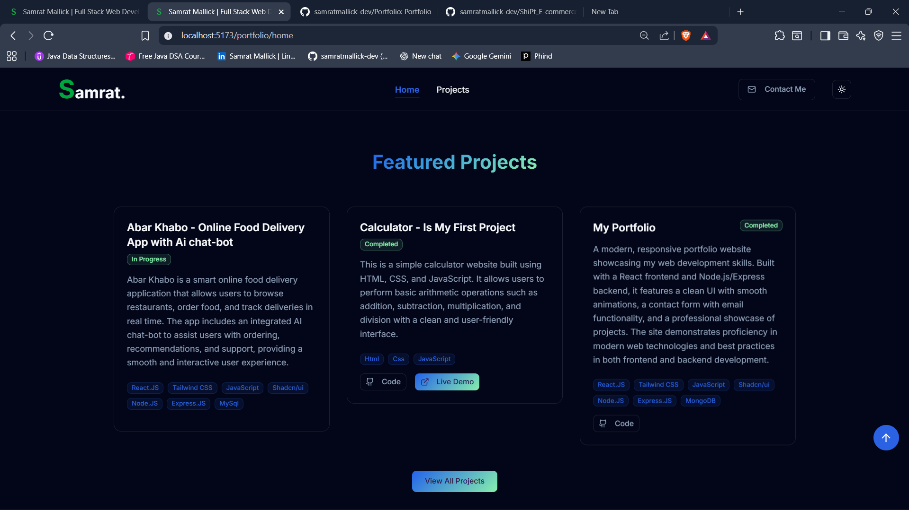 |
| Services | Projects listing |
| 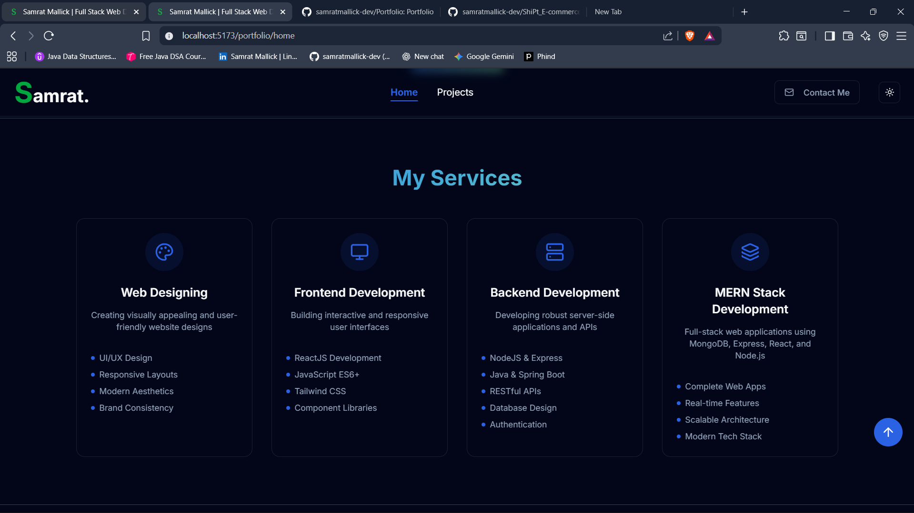 | 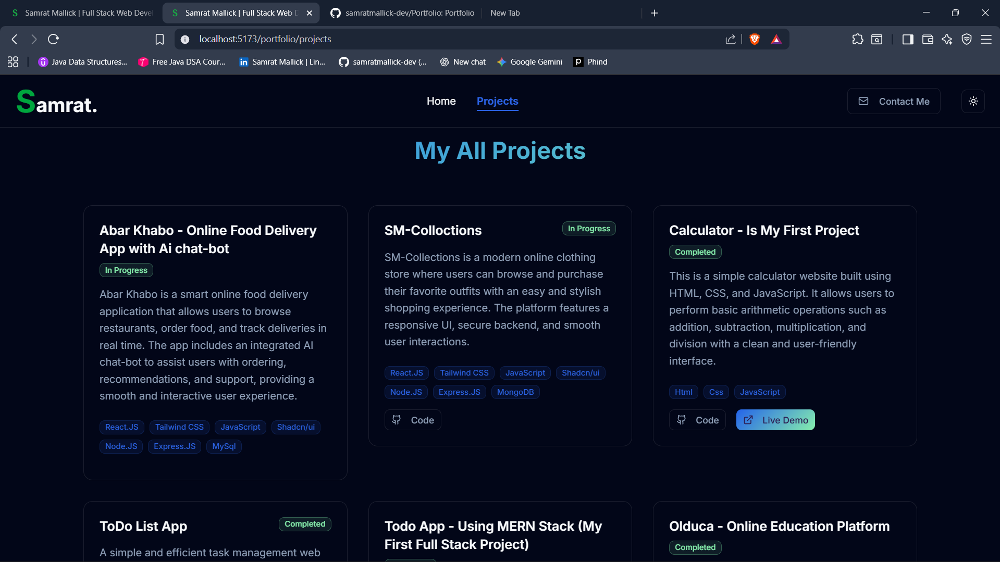 |
| Skills | Contact |
| 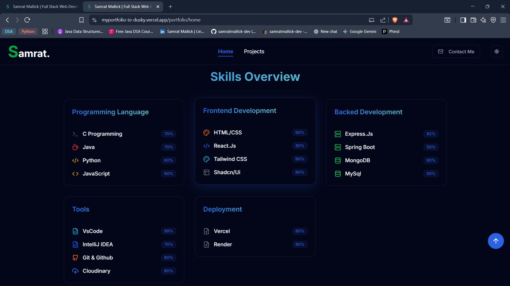 | 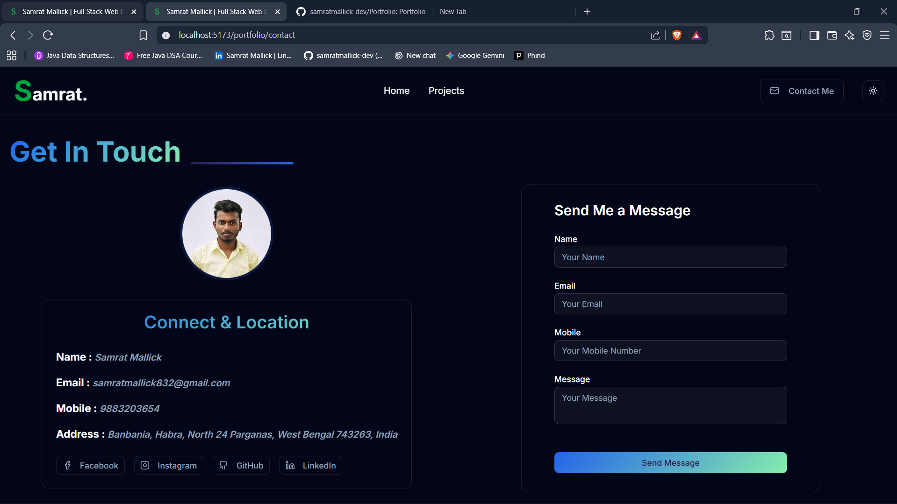 |

### Admin console
| Dashboard | Hero management |
| --- | --- |
| 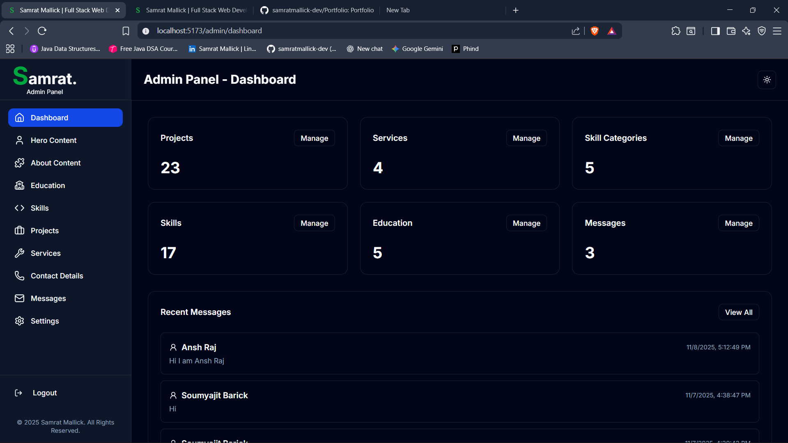 | 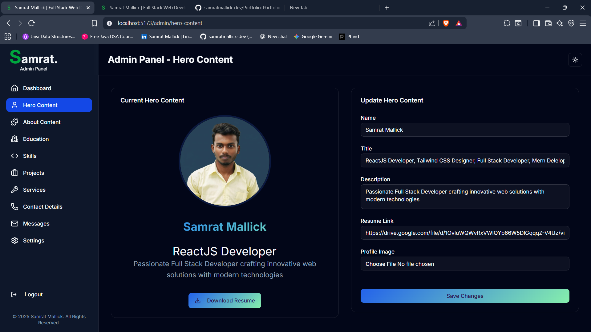 |
| Projects management | Settings |
| 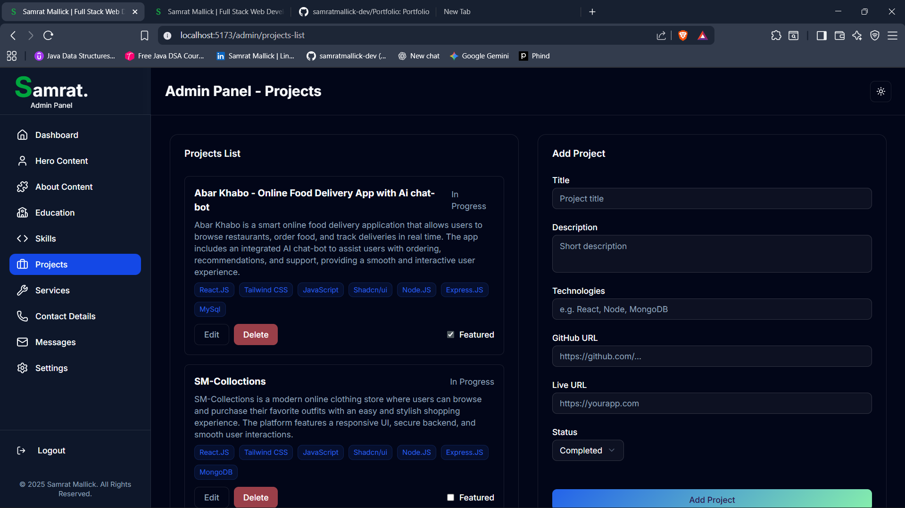 | 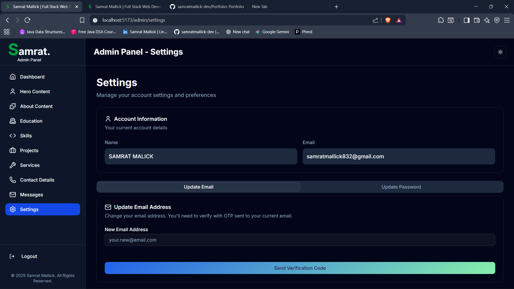 |
| Contact/messages | Auth |
| 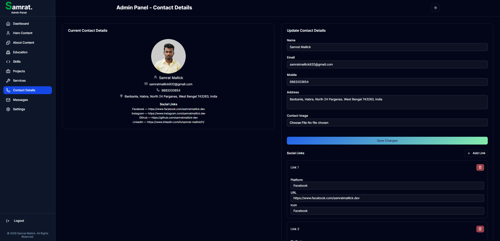 | 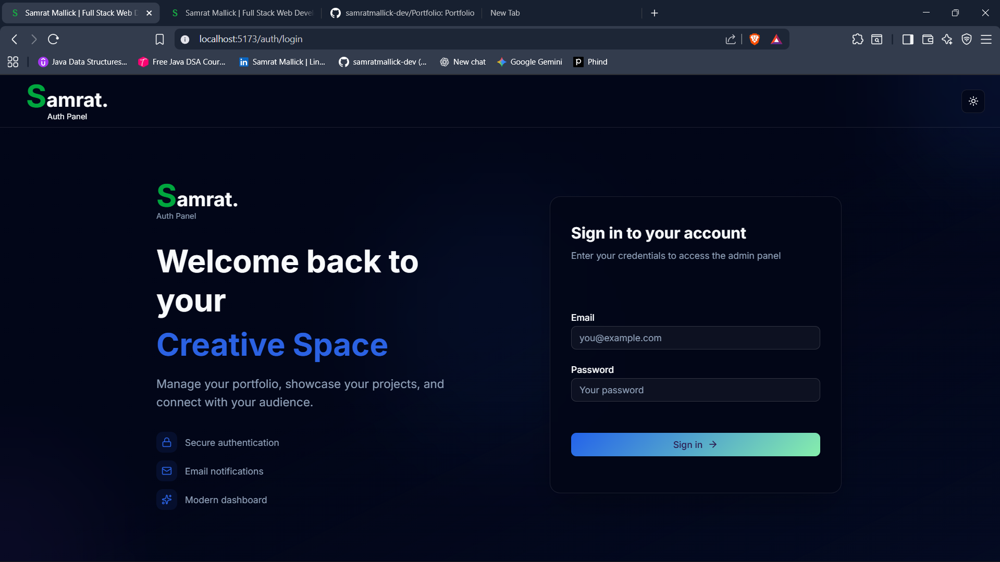 |

---

## Setup & Installation
### Prerequisites
- Node.js v18+
- MongoDB Atlas database
- Cloudinary account (API key/secret)
- SMTP account (e.g., Gmail App Password) for email/OTP

### Backend
```bash
cd backend
npm install
# create backend/.env using the values below
npm run dev            # development
npm start              # production
```
Initialize the first admin (one-time):
```bash
POST http://localhost:8000/api/v1/admin/initialize
{
  "username": "admin",
  "email": "your@email.com",
  "password": "yourpassword"
}
```

### Frontend
```bash
cd frontend
npm install
# create frontend/.env using the values below
npm run dev            # development
npm run build          # production build
npm run preview        # preview build
```

### Access Points
- Backend API: `http://localhost:8000/api/v1`
- Frontend: `http://localhost:5173`
- Admin dashboard: `http://localhost:5173/admin`

---

## Environment Variables
### Backend (`backend/.env`)
```
PORT=8000
CLIENT_URL=http://localhost:5173
MONGO_URL=mongodb+srv://<username>:<password>@<cluster>.mongodb.net
MONGO_NAME=myportfolio
CLOUD_NAME=<your_cloud_name>
CLOUD_API_KEY=<your_api_key>
CLOUD_API_SECRET=<your_api_secret>
EMAIL_HOST=smtp.gmail.com
EMAIL_PORT=587
EMAIL_USER=<your_email>
EMAIL_PASS=<app_password>
JWT_SECRET=<your_jwt_secret>
NODE_ENV=development
```

### Frontend (`frontend/.env`)
```
VITE_API_BASE_URL=http://localhost:8000/api/v1
VITE_APP_NAME=Samrat Mallick Portfolio
```

---

## Development Notes
- Layered backend: routes → controllers → services → repositories → models.
- Validation and error handling centralized in middleware.
- Media pipeline: Multer buffer → Cloudinary upload → stored URL + public_id.
- Authentication: JWT in httpOnly cookie; guard protected routes server-side and client-side.

---

## License & Usage
- Licensed under the [MIT License](LICENSE).
- This repository is currently **private** and intended for personal portfolio use. External distribution or commercial use should only occur with explicit written consent from Samrat Mallick.

---

## Contact
- Email: [samratmallick2002@gmail.com](mailto:samratmallick2002@gmail.com)
- LinkedIn: [linkedin.com/in/samrat-mallick01](https://linkedin.com/in/samrat-mallick01)
- GitHub: [github.com/samratmallick-dev](https://github.com/samratmallick-dev)

<div align="center">
© 2026 Samrat Mallick. All Rights Reserved.
</div>
